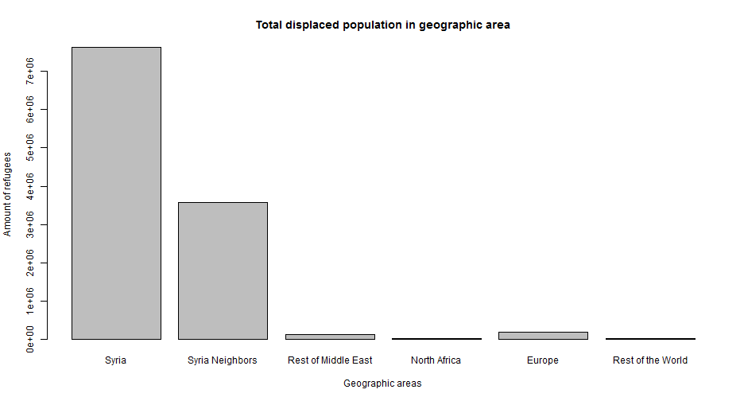

slides for the Data Products class
========================================================
author: LeGru
date: 

Motivation
========================================================

The war in Syria has been producing an immense humanitaria  catastrophy. 

Millions of people are displaced from their homes.

Images  coming from the EU borders give the  impression  of a river   
     of people trying desperatly to enter Europe

Are all Syrian Refugees moving to Europe?
========================================================

People wonder:  Why here?  Isn't there a better place for refugees? 

In this web app I will look at data from the UN to figure out where the refugees really are

Just a glimpse of the results
========================================================

 

The reality is...
========================================================

The majority of the refugees are still in Syria

Despite the great crises of the summart 2015

The amount of refugees travelling to Europe is minimal
